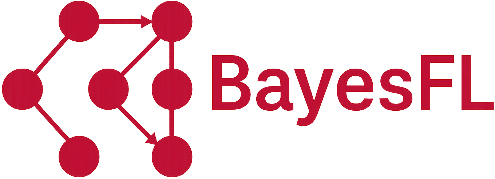

<p align="center">
  
</p>

**BayesFL** is a Java library for **federated learning of Bayesian Networks** (BNs), focused on three core components: **Bayesian Network fusion**, **structure learning**, and **Bayesian classification**. It supports multi-client environments and provides tools for discretization, evaluation, and experimental reproducibility.

## Main Features

- Structural learning of BNs in federated settings.
- Federated Bayesian classifiers (generative and discriminative Naive Bayes).
- Fusion and consensus of BNs under structural or parametric constraints.
- Modular architecture for implementing and evaluating custom algorithms.
- Experimental framework for large-scale benchmarking and reproducibility.

---


## 📁 Federated Components Overview and Project Structure

The source code is located under `src/main/java/` and is divided into core and auxiliary packages.

### Core Package: `bayesfl/`

It contains `Client.java` and `Server.java`, general components for federated execution. The `Client` encapsulates local learning; the `Server` coordinates fusion and convergence. The supported algorithms are organized into the following categories:

#### Structural Learning of BNs

| Algorithm    | Model | Fusion Type   | Fusion Method(s)                             | Notes                                                      |
|--------------|--------|----------------|-----------------------------------------------|------------------------------------------------------------|
| `BN_GES`     | `BN`   | Structural     | `BN_FusionUnion`, `BN_FusionIntersection`     | GES variants: `GES`, `pGES`, `cGES`, `fGES`                |
| `MCT_MCTS`   | `BN`   | Structural     | `MCT_Fusion`                                  | MCTS-based structure learning                              |

#### Bayesian Classifiers

| Algorithm    | Model | Fusion Type   | Fusion Method(s)                     | Notes                                                              |
|--------------|--------|----------------|---------------------------------------|--------------------------------------------------------------------|
| `PT_NB`      | `PT`   | Parametric     | `FusionPosition`                      | WEKA Naive Bayes; parameters averaged across clients               |
| `PT_CCBN`    | `PT`   | Parametric     | `PT_Fusion_Client`, `PT_Fusion_Server`| Discriminative NB (wdBayes) with federated gradient updates        |
| `MiniAnDE`    | `mAnDETree`  | Structural     | `mAnDETree_Fusion`                    | Ensemble of reduced AnDE classifiers; fuses trees learned locally    |

#### Federated Discretization

| Algorithm    | Model | Fusion Type   | Fusion Method     | Notes                                                       |
|--------------|--------|----------------|-------------------|--------------------------------------------------------------|
| `Bins_MDLP`  | `Bins` | Parametric     | `Bins_Fusion`     | Supervised discretization with global cut-point aggregation |


### Additional Modules

Beyond the core `bayesfl` package, the project includes complementary modules for structural learning and network fusion.

#### `consensusBN/` – Structural Fusion of Bayesian Networks

- `ConsensusUnion`: Fusion of BNs guided by a heuristic variable ordering. Includes restricted and unrestricted alternatives.
- `GeneticTreeWidthUnion`: Fusion/consensus via genetic algorithms with treewidth constraints to limit the size of the resulting BNs.
- `MinCutTreeWidthUnion`: Consensus of BNs using min-cut analysis.

#### `org.albacete.simd/` – Parallel and Distributed Structural Learning

- **GES family**: Implementations of `GES`, `pGES`, and `cGES` structural learning algorithm, including parallel and circular variants, and multi-threaded learning.
- **MCTSBN**: Monte Carlo Tree Search–based structure learning of BNs.
- **MiniAnDE**: MiniAnDE Bayesian classifier. A reduced version of AnDE specially designed for high-dimensional data.
- **Utilities**: Tools for scoring, graph handling, and experimental orchestration.

---

## 🛠️ Installation

BayesFL uses **Maven** for dependency management and build automation. To compile the project and generate a runnable `.jar` with all dependencies:

```bash
mvn clean package
```

This will generate a file like:

```
target/bayesfl-1.0-jar-with-dependencies.jar
```

You can run any experiment (e.g., classification, structure learning, fusion) using:

```bash
java -jar target/bayesfl-1.0-jar-with-dependencies.jar
```

The default `mainClass` is set to `bayesfl.experiments.ClusterExperiment`, but you can override it if needed. For example:

```bash
java -cp target/bayesfl-1.0-jar-with-dependencies.jar bayesfl.experiments.CCBNExperiment
```

### Dependencies

BayesFL relies principally on Tetrad for working with the structure of BNs and WEKA for classification tasks. These libraries are already included in the pom.xml file:
- Tetrad: Used for Bayesian Network structure learning and manipulation. [Tetrad library](https://github.com/cmu-phil/tetrad)
- WEKA: Used for machine learning algorithms, particularly for classification, and data management. [WEKA library](https://www.cs.waikato.ac.nz/ml/weka/)


---


## 📚 Related Publications

### 🔄 Federated Learning (BayesFL Core)

- **Pablo Torrijos, Juan C. Alfaro, José A. Gámez, José M. Puerta**  
  *Federated Learning with Discriminative Naive Bayes Classifier*  
  *25th International Conference on Intelligent Data Engineering and Automated Learning (IDEAL 2024)*  
  [DOI: 10.1007/978-3-031-77738-7_27](https://doi.org/10.1007/978-3-031-77738-7_27) | [arXiv:2502.01532](https://arxiv.org/abs/2502.01532)

- **Pablo Torrijos, José A. Gámez, José M. Puerta**  
  *FedGES: A Federated Learning Approach for Bayesian Network Structure Learning*  
  *Machine Learning (2025)* (Accepted for publication, extended version)*  

  - *Conference version:* **Pablo Torrijos, José A. Gámez, José M. Puerta**  
    *FedGES: A Federated Learning Approach for Bayesian Network Structure Learning*  
    *27th International Conference on Discovery Science (DS 2024)*  
    [DOI: 10.1007/978-3-031-78980-9_6](https://doi.org/10.1007/978-3-031-78980-9_6) | [arXiv:2502.01538](https://arxiv.org/abs/2502.01538)


---

#### 🧬 Bayesian Network Fusion (`consensusBN`)

- **Pablo Torrijos, José M. Puerta, José A. Gámez, Juan A. Aledo**  
  *Bayesian Network Structural Consensus via Greedy Min-Cut Analysis*  
  *40th AAAI Conference on Artificial Intelligence (AAAI 2026) (Accepted)*  
  [arXiv:2504.00467](https://arxiv.org/abs/2504.00467)

- **Pablo Torrijos, José A. Gámez, José M. Puerta, Juan A. Aledo**  
  *Genetic Algorithms for Tractable Bayesian Network Fusion via Pre-Fusion Edge Pruning*  
  *Proceedings of the Genetic and Evolutionary Computation Conference 2025 (GECCO 2025)*  
  [DOI: 10.1145/3712256.3726333](https://doi.org/10.1145/3712256.3726333)

- **Pablo Torrijos, José A. Gámez, José M. Puerta**  
  *Structural Fusion of Bayesian Networks with Limited Treewidth Using Genetic Algorithms*  
  *IEEE Congress on Evolutionary Computation (CEC 2024)*  
  [DOI: 10.1109/CEC60901.2024.10611976](https://doi.org/10.1109/CEC60901.2024.10611976)

- **José M. Puerta, Juan A. Aledo, José A. Gámez, Jorge D. Laborda**  
  *Efficient and Accurate Structural Fusion of Bayesian Networks*  
  *Information Fusion, Vol. 66, 2021*  
  [DOI: 10.1016/j.inffus.2020.09.003](https://doi.org/10.1016/j.inffus.2020.09.003)


#### ⚙️ Parallel and Distributed BN Structural Learning (`org.albacete.simd`)

- **Jorge D. Laborda, Pablo Torrijos, José M. Puerta, José A. Gámez**  
  *Parallel Structural Learning of Bayesian Networks: Iterative Divide and Conquer Algorithm Based on Structural Fusion*  
  *Knowledge-Based Systems, Vol. 296, 2024*  
  [DOI: 10.1016/j.knosys.2024.111840](https://doi.org/10.1016/j.knosys.2024.111840)

- **Jorge D. Laborda, Pablo Torrijos, José M. Puerta, José A. Gámez**  
  *Distributed Fusion-based Algorithms for Learning High-Dimensional Bayesian Networks: Testing Ring and Star Topologies*  
  *International Journal of Approximate Reasoning, Vol. 175, 2024*  
  [DOI: 10.1016/j.ijar.2024.109302](https://doi.org/10.1016/j.ijar.2024.109302)
  - *Conference version:* **Jorge D. Laborda, Pablo Torrijos, José M. Puerta, José A. Gámez**  
    *A Ring-Based Distributed Algorithm for Learning High-Dimensional Bayesian Networks*  
    *17th European Conference on Symbolic and Quantitative Approaches to Reasoning with Uncertainty (ECSQARU 2023)*  
    [DOI: 10.1007/978-3-031-45608-4_10](https://doi.org/10.1007/978-3-031-45608-4_10) | [arXiv:2409.13314](https://arxiv.org/abs/2409.13314)

#### 🔍 MCTS BN Structural Learning (`org.albacete.simd.mctsbn`)

- **Jorge D. Laborda, Pablo Torrijos, José M. Puerta, José A. Gámez**  
  *Enhancing Bayesian Network Structural Learning with Monte Carlo Tree Search*  
  *20th International Conference on Information Processing and Management of Uncertainty in Knowledge-Based Systems (IPMU 2024)*  
  [DOI: 10.1007/978-3-031-74003-9_32](https://doi.org/10.1007/978-3-031-74003-9_32) | [arXiv:2502.01527](https://arxiv.org/abs/2502.01527)

#### 📊 Bayesian Classification (`org.albacete.simd.mAnDE`)

- **Pablo Torrijos, José A. Gámez, José M. Puerta**  
  *MiniAnDE: A Reduced AnDE Ensemble to Deal with Microarray Data*  
  *24th International Conference on Engineering Applications of Neural Networks (EANN / EAAAI 2023)*  
  [DOI: 10.1007/978-3-031-34204-2_12](https://doi.org/10.1007/978-3-031-34204-2_12) | [arXiv:2311.12879](https://arxiv.org/abs/2311.12879)


---

## 📄 License

This project is licensed under the **MIT License**.  
© 2025 Universidad de Castilla-La Mancha, Spain.
